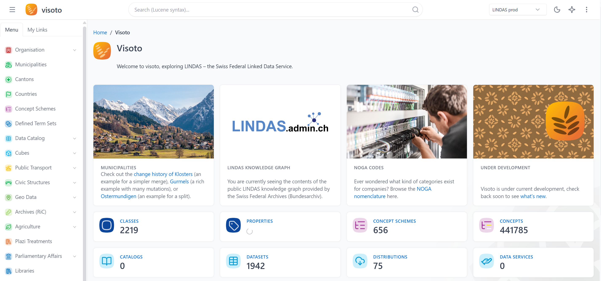
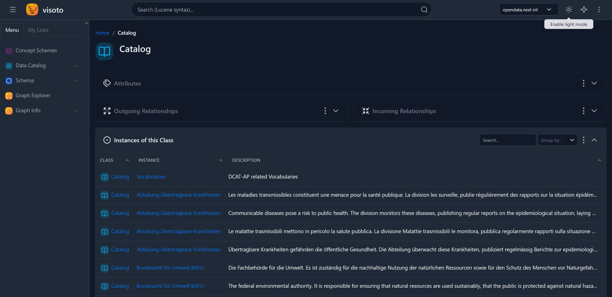
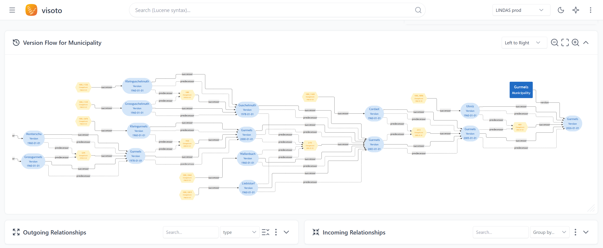

## Visoto

Visoto is a Go web application for browsing and visualizing RDF linked data resources via SPARQL endpoints. It renders resource pages using type-specific templates, supports full-text search, and exposes an MCP server for AI assistant integration.

You can find a demo at https://visoto.hutzli.org.

Visoto is still in development and not all features work properly.



### Features

- **RDF Resource browser** — fetch any RDF resource by IRI; templates are resolved automatically from the resource's `rdf:type`
- **Full-text search** — search across linked data resources with class and property filters
- **Faceted search** — filter instance tables by property value, with enum, free-text and numeric-range facets resolved against the endpoint
- **Multi-endpoint support** — switch between named SPARQL endpoints (e.g. LINDAS prod/int/test) via a sidebar menu
- **Graph Explorer** — interactive RDF graph visualization powered by Graph Explorer (Ontodia fork)
- **Schema derivation** — derive a SHACL-style schema from instance data and render it as a UML-like class diagram
- **Cube catalog** — browse `cube:Cube` datasets, their dimensions and versions
- **Data upload & named graphs** — load RDF from a file or URL into a named graph; list, export and delete graphs
- **AI chat** — ask questions about linked data resources, powered by Google Gemini
- **Endpoint monitoring** — track SPARQL endpoint availability and response times over time
- **MCP server** — built-in Model Context Protocol server at `/mcp` for AI tool integration
- **Bookmarks** — save resources to a sidebar list for quick return
- **Dark mode** — toggle between light and dark themes
- **Responsive UI** — built with Tabler (Bootstrap 5) and Tabulator for data tables

### Prerequisites

- Go 1.25+
- A SPARQL endpoint (default: [LINDAS](https://ld.admin.ch/query/))
- Optional: Google Gemini API key (for the chat feature)

### Setup

1. **Clone the repo and install dependencies:**
   ```sh
   go mod download
   ```

2. **Create your config file:**
   ```sh
   cp visoto.config.example visoto.config
   ```
   Edit `visoto.config` to set your SPARQL endpoint, port, and optional Gemini API key.

3. **Run the server:**
   ```sh
   go run ./cmd/visoto/
   ```

4. **Open the app:**
   - Web UI: `http://localhost:8060`
   - Health check: `http://localhost:8060/ping`
   - MCP server: `http://localhost:8060/mcp`

**Alternative: run with Docker:**
```sh
docker build -t visoto .
docker run -e GIN_MODE=release -p 8060:8060 \
  -v ./visoto.config:/app/visoto.config:ro \
  visoto
```
See [docs/deployment.md](docs/deployment.md) for full production Docker + Caddy setup.

**Optional: deploy with QLever private triplestore:**
```sh
./deploy.sh <server> [user] --with-qlever
```
This starts QLever in an isolated Docker network reachable only by Visoto. See [qlever/](qlever/) and [scripts/qlever-start-dev.sh](scripts/qlever-start-dev.sh) for local dev setup and data loading instructions.

### Configuration

Configuration is loaded from `visoto.config` (TOML format). See [`visoto.config.example`](visoto.config.example) for all options.

Key settings:

| Setting | Description | Default |
|---|---|---|
| `application.port` | HTTP port (code default is `8080`; example config uses `8060` — set explicitly) | `8080` |
| `application.sparqlEndpoint` | Default SPARQL endpoint URL | — |
| `application.sparqlEndpoints` | Named endpoints for the switcher menu. Each entry takes `name`, `url`, `slug`, `tag`, `default`, `monitor`, plus optional `search_provider`, `export_provider` and `access_token` / `username` / `password` for write operations | — |
| `application.timeout` | SPARQL query timeout (seconds) | `30` |
| `application.gemini_api_key` | Google Gemini API key for chat | — |
| `application.allow_private_upload_urls` | Allow uploads to fetch from loopback/private hosts (test environments only) | `false` |
| `rdf.prefixes` | RDF prefix declarations (SPARQL or Turtle notation) | — |
| `rdf.type_priority` | Priority order for template resolution when a resource has multiple types | — |
| `rdf.magic_properties` | `visoto:<key>` tokens expanded to property paths in template queries | — |
| `ontologies` | Ontologies offered for import in the upload dialog (`name`, `url`, `graph`) | — |
| `logging.level` | Log level: `DEBUG`, `INFO`, `WARN`, `ERROR` | `INFO` |
| `mcp.port` | MCP port (unused when embedded in main server) | `8070` |
| `PORT` (env var) | Overrides `application.port` — lets a second instance run without editing the config | — |
| `GIN_MODE` (env var) | Gin framework mode: `debug`, `release`, `test` | `debug` |

The `slug` is the only endpoint identifier that travels over the wire: it drives
shareable `?endpoint=<slug>` links and must be unique across all entries.

### Testing

Run the unit tests:
```sh
go test ./...
```

CI (`.github/workflows/ci.yml`) runs on every push to `main` and on pull requests:
a `gofmt` check, `go vet`, `go build`, `go test`, and finally a boot smoke test.

The smoke test exists because templates are parsed at **runtime**, not compile
time — a malformed template panics during startup and `go build` cannot catch it.
CI therefore starts the compiled binary and polls `/ping`; a `pong` proves every
layout, partial, page, class and instance template parsed successfully.

### Documentation

| Document | Audience |
|---|---|
| [Getting Started](docs/getting-started.md) | Run locally for the first time |
| [Architecture Overview](docs/architecture.md) | Understand how the system fits together |
| [Configuration Reference](docs/configuration.md) | All `visoto.config` fields explained |
| [Template Authoring Guide](docs/templating.md) | Create custom templates for your RDF types |
| [Deployment Guide](docs/deployment.md) | Docker + Caddy production setup |

### Project Structure

```
cmd/visoto/        — main entry point
internal/
  chat/            — Gemini AI chat handler
  config/          — TOML config loading
  export/          — named-graph export (Turtle, N-Quads, TriG, RDF/XML, JSON-LD)
  facet/           — faceted-search filter construction
  logger/          — structured slog logger
  mcp/             — MCP server (AI tool integration)
  monitor/         — simple SPARQL endpoint health monitoring
  parser/          — SPARQL preprocessor (template → query → result)
  resource/        — RDF resource resolution and template matching
  search/          — full-text search over SPARQL endpoints
  sparql/          — SPARQL query execution
  templates/       — Go template loader
  upload/          — RDF upload and named-graph management
templates/
  layout/          — shared layout templates (base, sidebar, header, footer)
  pages/           — static page templates (home, search, monitoring, …)
  classes/         — class-level RDF templates
  instances/       — instance-level RDF templates
  partials/        — reusable SPARQL components (table, graph, grid, tree, metric, mermaid)
  components/      — smaller shared fragments (literals, relationships, page header)
static/            — CSS, JS, images
```

### Routes

| Method | Path | Description |
|---|---|---|
| `GET` | `/` | Home page |
| `GET` | `/search` | Full-text search |
| `GET` | `/resource?iri=<IRI>&endpoint=<slug>` | Resource page |
| `GET` | `/resource/*path` | Legacy path form — 301 redirect to `/resource?iri=` |
| `GET` | `/:page` | Static pages by name (`about.html`, `classes.html`, …) |
| `GET` | `/monitoring` | Endpoint monitoring dashboard |
| `GET` | `/api/monitoring/status` | Monitoring status (JSON) |
| `POST` | `/api/monitoring/toggle` | Enable/disable monitoring |
| `GET` | `/api/monitoring/data` | Historical monitoring data (JSON) |
| `GET` | `/api/metric/:id` | Lazy-load metric counts (HTMX) |
| `GET` | `/api/async-table/:id` | Lazy-loaded table fragment (HTMX) |
| `GET` | `/api/async-table-data/:id` | Working-set table rows (JSON) |
| `GET` | `/api/faceted-table/:id` | Faceted table — fragment or JSON, content-negotiated |
| `GET` | `/api/facet-values/:id/:var` | Distinct values and counts for one facet (JSON) |

The five async routes above all require `?src=<template set>` (e.g.
`src=pages/plazi.html`): `:id` names a `<sparql-async>` declaration, and those are
scoped to the template set that declares them, not global. The frontend attaches it
automatically — see [Async query scope](docs/templating.md#async-query-scope).
| `POST` | `/api/upload` | Upload RDF from a file or URL into a named graph |
| `GET` | `/api/named-graphs` | List named graphs (JSON) |
| `DELETE` | `/api/named-graphs` | Delete a named graph |
| `GET` | `/api/export-graphs` | Export named graphs (Turtle, N-Quads, … or zip) |
| `GET` | `/api/ontologies` | Ontologies available for import (JSON) |
| `POST` | `/api/cache/purge` | Flush the Caddy/Souin response cache |
| `POST` | `/api/chat` | Gemini AI chat |
| `ANY` | `/mcp` | MCP server endpoint |
| `GET` | `/health` | MCP health check |
| `GET` | `/ping` | Health check |

### Screenshots




