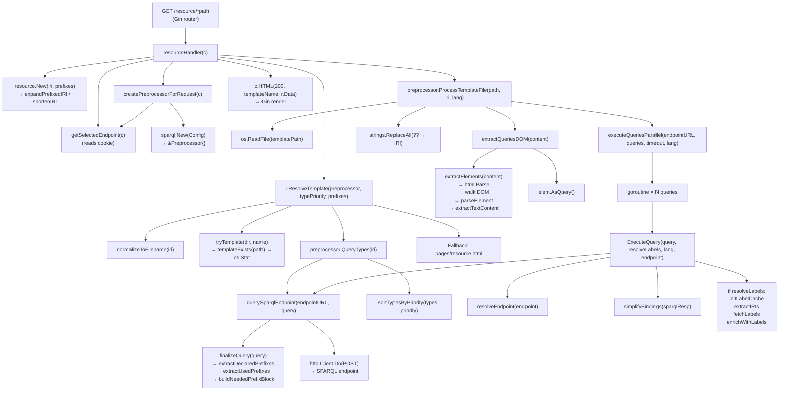

# `resourceHandler` Call Graph

## Key Stages

1. **Resource creation** — parse/validate IRI, expand/shorten prefix (`resource.New`)
2. **Template resolution** — filesystem lookup: `classes/` → `instances/` → RDF type query → fallback `pages/resource.html`
3. **Template processing** — read file → parse DOM → extract `<sparql-query>` elements → execute in parallel → optional label enrichment
4. **Render** — pass `TemplateData` to Gin's HTML renderer (`c.HTML`)

## Source Locations

| Function | File |
|---|---|
| `resourceHandler` | `cmd/visoto/main.go:93` |
| `createPreprocessorForRequest` | `cmd/visoto/main.go:60` |
| `resource.New` | `internal/resource/resource.go:32` |
| `ResolveTemplate` | `internal/resource/resource.go:80` |
| `ProcessTemplateFile` | `internal/sparql/template.go:26` |
| `extractQueriesDOM` | `internal/sparql/template.go:182` |
| `extractElements` | `internal/sparql/template.go:101` |
| `executeQueriesParallel` | `internal/sparql/query.go:282` |
| `ExecuteQuery` | `internal/sparql/query.go:337` |
| `querySparqlEndpoint` | `internal/sparql/query.go:140` |
| `finalizeQuery` | `internal/sparql/query.go:110` |
| `QueryTypes` | `internal/sparql/query.go:254` |
